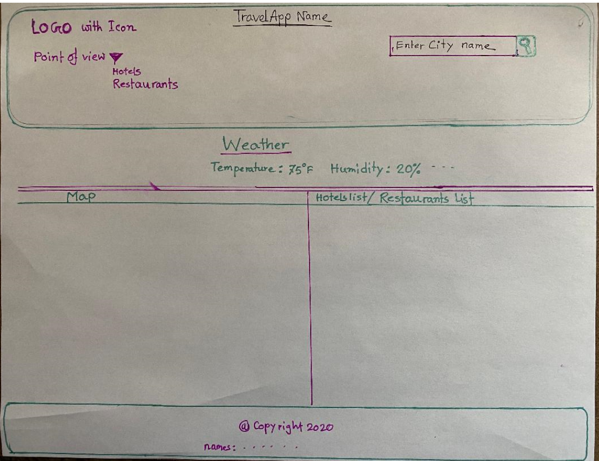
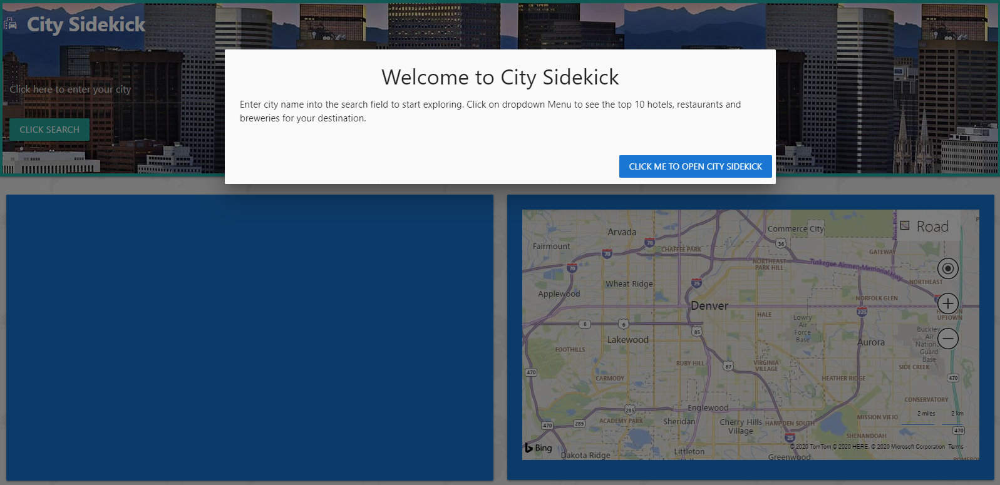

## project for Travel Application
The repository for the first project of the DU Coding Camp
App name - City Sidekick
Team members -  Raufun, Ben, John, and Mety
## User Story
This is our Travel App
As A: new visitor to a city
I Want An: app that uses my location to provide current weather & restaurant/hotel/breweries recommendations
So That I Can: Experience the city to its fullest

## Application Requirements/Acceptance Criteria
* Must use at least two server-side APIs
* Must use a CSS framework _other than_ Bootstrap
* Must be interactive (i.e: accept and respond to user input)
* Use at least one new third-party API
* Must have a polished UI
* Must meet good quality coding standards
* Does not use alerts, confirms or prompts (look into _modals_)
* Must be deployed to GitHub Pages
## The motivation for its development:
  *
## Breakdown of tasks and roles:
  * Our design process consisted of meeting as a group of four members.
  * Discussing our strengths and weaknesses.
  * Breaking down into two groups for front and back end design.
  * Discuss the technologies and libraries of interest to use. 
  * Developed a sketch of the final product.
## The technologies we used:  
  * API - Bing Maps and OpenWeather, moment.js
  * Libraries - Materialize css for framework and autocomplete, JQuery
  * Programing languages - javascript, jquery, 
  * Database - 
## Directions for future development:
*Add more search criteria and filters for more specific searches
*Create clickable map pins to show more information in a modal
*Add more APIs for concerts/hiking trails/events
*Make the BING Map more responsive
*Add navigation to BING Map
*Implement rideshare (Uber/Lyft) option
*Location sharing for more accurate recommendations
*Get celebrity endorsement (preferably Ted Danson)
Sell app to Microsoft

## Getting Started
  The App site is deployed at https://johngarcia144.github.io/city-sidekick/ website. There is a modal that pops up after the page load to instruct you on how the city sidekick app works. Once you enter the city name on city input field and click the search button then weather window show up in a middle panel along with the current weather conditions. Once you click the dropdown menu then you can select hotels or restaurants or breweries. 
  When you select each category the you can see the results below the weather panel. There are 2 cards, one to the left that tells you more about the list of hotels, restaurants, and breweries names and the one to the right that contains a map with the location pin for hotels, restaurants, and breweries. The footer explains who was on the team that created the application as well as linking to their portfolio sites.
## Challenges and successes:
*Displaying the map with markers and updating the map with the user search criteria
*Tying the event listeners together to make the app smoother
*Material UI was intuitive and relatively easy to work with
*Successfully displayed map markers after hours of headaches
*User input successfully updates map and list information

## Presentation Requirements:
  * You will be responsible for preparing a formal, 10 minutes presentation. 
  * One minute description for application
  * The motivation for its development
  * Breakdown of tasks and roles
  * The technologies you used 
  * A demonstration of its functionality
  * Directions for future development
  * Links to the deployed application and the GitHub repository
